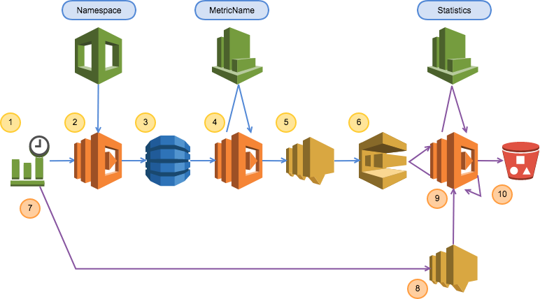

# archive-cloudwatch-metrics-to-s3 

- サーバレスログ管理PoC
- CloudFormation サンプルテンプレート

# 構成図




# 特徴

- 14日で消去されるCloudwatchの60秒測定値、JSON形式でS3に退避します。
- コンピュートリソースはLambdaを非同期に利用します。
- Cloudwatch→S3を実現するLambdaはSQSで制御。並列実行数の制御が可能です。
- レコード区切りが改行となったJSONL形式で出力する事で、Athenaでそのまま利用可能です。


## Athena利用例 

```
drop table cloudwatch02.tb4
;
CREATE EXTERNAL TABLE IF NOT EXISTS cloudwatch02.tb4 (
  `Timestamp` string,
  SampleCount float,
  Average float,
  Sum float,
  Minimum float,
  Maximum float 
)
ROW FORMAT SERDE 'org.openx.data.jsonserde.JsonSerDe'
WITH SERDEPROPERTIES (
  'serialization.format' = '1'
) LOCATION 's3://###########/AWS/Route53/HealthCheckPercentageHealthy/#######-daa5-4db9-bf46-2d7109d924b2/2018/02/'
TBLPROPERTIES ('has_encrypted_data'='false');


select 
a.ngcnt, b.okcnt, c.totalcnt
 , a.ngcnt/ c.totalcnt * 100 as ng_rate
 , b.okcnt/ c.totalcnt * 100 as ok_rate
 
 from
(
SELECT cast(count(1) as DOUBLE) as ngcnt
FROM "cloudwatch02"."tb4" 
where average < 66
) a,
(
SELECT cast(count(1) as DOUBLE) as okcnt
FROM "cloudwatch02"."tb4" 
where average >= 66
) b,
(
SELECT cast(count(1) as DOUBLE) as totalcnt
FROM "cloudwatch02"."tb4" 
) c
```

